# Abeeway EVB initial FW flashing

## Table of Contents

[1 INTRODUCTION](#1-introduction)

[1.1 Purpose](#11-purpose)

[1.2 Intended Audience](#12-intended-audience)

[1.3 Minimum requirements](#13-minimum-requirements)

[2 PREPARING THE EVB BOARD AND FLASHING STM32WB](#2-preparing-the-evb-board-and-flashing-stm32wb)

[2.1 First flashing operation of the STM32WB](#21-first-flashing-operation-of-the-stm32wb)

[2.2 STM32CubeProgrammer with ST-Link](#22-stm32cubeprogrammer-with-st-link)

[2.3 Flash FUS and BLE stack Firmware upgrade](#23-flash-fus-and-ble-stack-firmware-upgrade)

[2.4 Flashing the Bootloader](#24-flashing-the-bootloader)

[2.5 Flashing an application firmware](#25-flashing-an-application-firmware)

[2.5.1 Flashing with the bootloader](#251-flashing-with-the-bootloader)

[2.5.2 Flashing with STM32Programmer or STM32CubeIDE](#252-flashing-with-stm32programmer)

[3 GEOLOC MODULE CONFIGURATION AND MIDDLEWARE UPDATE](#3-geoloc-module-configuration-and-middleware-update)

[3.1 Manufacturing firmware application (MFG)](#31-manufacturing-firmware-application-mfg)

[3.2 Update of the LR1110](#32-update-of-the-lr1110)

[3.3 LoRa provisioning](#33-lora-provisioning)

[3.4 FW update of the MT3333 chipset](#34-fw-update-of-the-mt3333-chipset)

## 1 INTRODUCTION

### 1.1 Purpose

The goal of this document is to provide a simple guide on how to flash
and test the functionality of the Geolocation Module LBEU5ZZ1WL-633 or
LBEU5ZZ1WL-857 using the EVK. The module with the latter part number
LBEU5ZZ1WL-857 does not include the MediaTek MT3333 GNSS chipset.

The scope includes the software components running on STM32WB MCUs such as
the firmware Upgrade Service (FUS) and the Bluetooth LE stack for the
Cortex M0 and the application firmware for cortex M4 MCU. The document
also describes the FW update operations for the LR1110 and MT3333
chipsets.

### 1.2 Intended Audience

The intended audience for this document is for the hardware, test, and
production teams.

### 1.3 Minimum requirements

To follow this tutorial, you should have:

- An EVK board of the Geoloc Module i.e EVK v2.3 or v2.4, P/N:
    LBEU5ZZ1WL-633EVB
- A computer with the following software installed:
  - [STM32CubeProgrammer](https://www.st.com/en/development-tools/stm32cubeprog.html)
  - [Tera Term](https://teratermproject.github.io/index-en.html) on Windows or minicom
    on Linux

## 2. PREPARING THE EVB BOARD AND FLASHING STM32WB

### 2.1 First flashing operation of the STM32WB

To flash custom firmware, we first need to flash STMicroelectronic's
firmware. It consists of two parts:

- Firmware Upgrade Service ("FUS")
- BLE Stack firmware

### 2.2 STM32CubeProgrammer with ST-Link

The figure below shows the minimum configuration to program the geoloc module with [`STM32CubeProgrammer`](https://www.st.com/en/development-tools/stm32cubeprog.html) trough an USB cable connected to the USB3 port. See the
[Type1WL EVB User Manual](https://github.com/Abeeway/abeeway-geolocation-module/tree/master/docs/Type1WL-EVB_user_manual.pdf)
for further details of the board set-up.

<p align="center">
  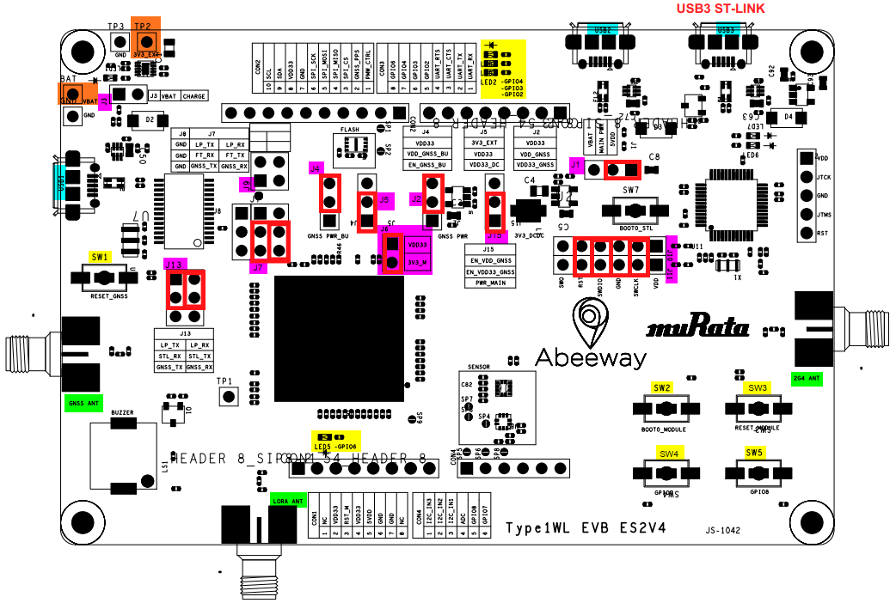
</p>
  
<p align="center"><i>
  Figure 1: Default EVB setting in red. Module supplied with 5V USB (J1,J5) and GNSS power up (J4, J15, J2)
</i></p>

Connect the EVB through the USB3 interface to your computer and open the `STM32CubeProgrammer` application.

To interface with the module for debugging and programming, select
ST-LINK protocol and click on the ***Connect*** button on the right-hand
side, as shown below:

<p align="center">
  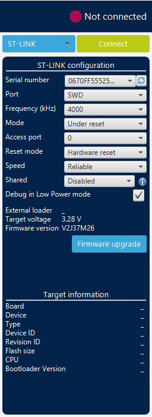
  =>
  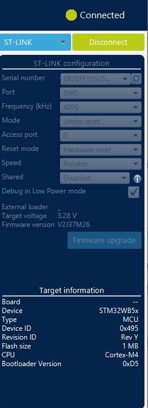
</p>

<p align="center"><i>Figure 2: Connect the EVB via the ST-Link</i></p>

If the software asks for upgrading the firmware of the ST-Link debugger, accept and upgrade the ST-Link firmware and then click on ***Firmware Upgrade Service***. Please note that the actual version of the ST-Link Firmware is shown on the left side above the ***Upgrade*** button.

<p align="center">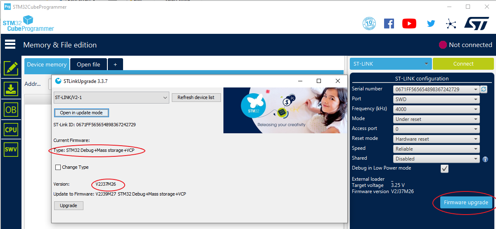</p>

<p align="center"><i>Figure 3: ST-Link upgrade if needed</i></p>

### 2.3 Flash FUS and BLE stack Firmware upgrade

When ST-Link is connected, go to the firmware upgrade services (FUS)
interface by clicking on the ***Firmware Upgrade Services*** button on the left menu bar and initialize the FUS by clicking on ***Start FUS*** button. See the logs at the bottom of the window.


<p align="center">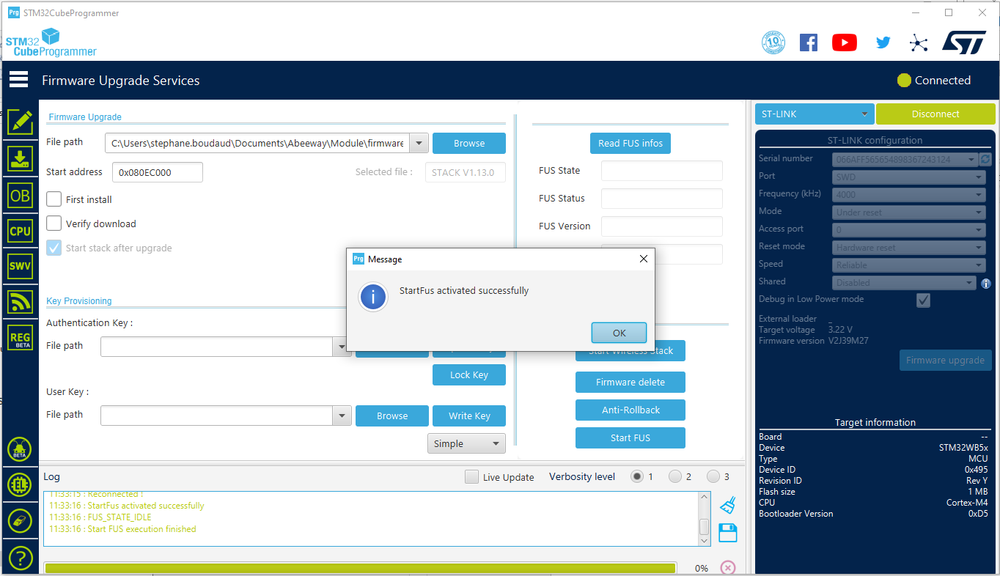</p>

<p align="center"><i>Figure 4: Start the FUS</i></p>

Read the FUS version by clicking on Read FUS info. The initial version
is v1.0.2.0 and the FUS can be updated to v1.2.0.0.

<p align="center">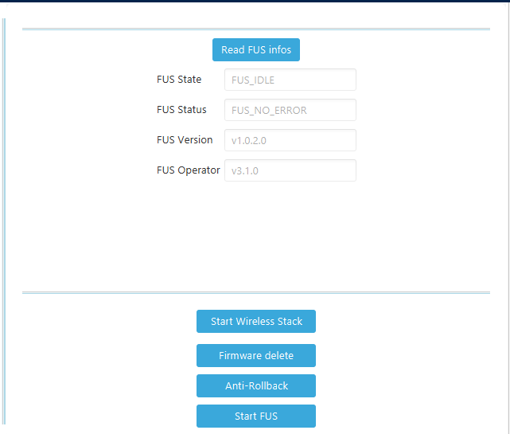</p>

*Note: The names of buttons on the left menubar are shown only if you click on the top left icon of the window. It will expand the menu bar and show the button's descriptions.*

To upgrade FUS to version 1.2.0.0

- select the ***Firmware Upgrade Services*** button on the left menu bar,
- download the [`stm32wb5x_FUS_fw.bin`](https://github.com/Abeeway/abeeway-geolocation-module/tree/master/firmware-binaries/ble) file in a separate window,
- click on the ***Browse*** button and select the downloaded file,
- set the ***Start address*** field to `0x080EC000`
- and click on ***Firmware upgrade***.

<p align="center"></p>

<p align="center"><i>Figure 5: Update FUS to version 1.2.0.0</i></p>

*Note: You can check the FUS version again by clicking on the ***Read FUS infos*** button.*

To upgradde the Bluetooth® LE Stack

- select the ***Firmware Upgrade Services*** button on the left menu bar,
- download the [`stm32wb5x_BLE_Stack_full_fw.bin`](https://github.com/Abeeway/abeeway-geolocation-module/tree/master/firmware-binaries/ble) file in a separate window,
- click on the ***Browse*** button and select the downloaded file,
- set the ***Start address*** field to `0x080CE000`,
- check the ***First Install*** checkbox if this is the first time you are installing the stack,
- and click on ***Firmware upgrade***.

<p align="center">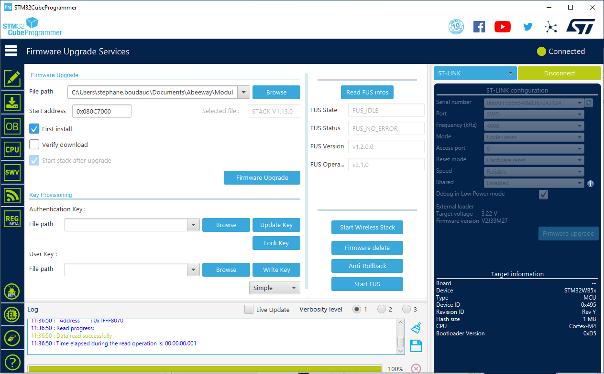</p>

<p align="center"><i>Figure 6: Update the BLE Stack V1.13.0</i></p>

*Note: FUS needs to be activated to flash BLE firmware.*

### 2.4 Flashing the Bootloader

The next step is to flash the Bootloader firmware. This is a small piece
of code starting at address `0x08000000` (at the beginning of the user flash
space).

The purpose of the bootloader is to check whether it should wait for an application binary download via USB2 port or jump to the loaded application firmware.

To flash the Bootloader

- select the ***Erasing & programing*** button on the left menu bar,
- download the [`abw-bootloader-release_v3.0.bin`](https://github.com/Abeeway/abeeway-geolocation-module/blob/master/firmware-binaries/bootloader) file in a separate window,
- click on the ***Browse*** button and select the downloaded file,
- set the ***Start address*** field to `0x08000000`,
- check the ***First Install*** checkbox if this is the first time you are installing the stack,
- and click on ***Firmware upgrade***.

<p align="center">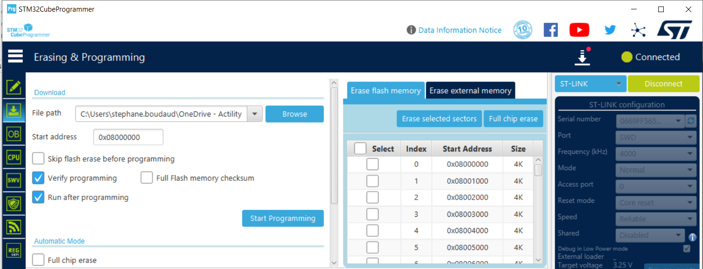</p>

<p align="center"><i>Figure 7: Flashing Bootloader</i></p>

*Note: It is possible to do a full chip erase prior to flash the bootloader to erase any old application firmware (Item 0), BLE stack and FUS will not get removed.*

### 2.5 Flashing an application firmware

#### 2.5.1 Flashing with the bootloader

At power up when no application software is installed, the bootloader is directly accessible via the STM32 USB port (USB2 connector on EVK board) using a terminal emulator (minicom or Tera Term) set to 57600 baud 8N1.
With an application, a CLI command allows to switch the MCU to bootloader mode.

*Note that the bootloader have a 60sec time out to switch back to the application program.*

The Bootloader commands are:

```bash
*ABWu: xModem transfer*
*ABWe: erase user config*
*v: version*
*r: reset*
*?: help*
```

The steps to flash an application firmware with the Bootloader are the following:

- Enter command: `ABWe` (in order to remove the user configuration parameters if flashing a new application firmware )
- Enter command: `ABWu`
- Load the application binary file (with `.bin` extension) to transfer with XMODEM
  - Minicom: **CTRL-A S -> Xmodem** and select the `.bin` file
  - TeraTerm : **Menu -> Transfer -> Xmodem -> Send** and select the `.bin` file
- Enter command: `r` to reset the device.

<p align="center">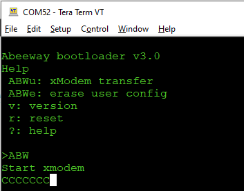</p>

#### 2.5.2 Flashing with STM32Programmer

For experienced users, the application firmware can be uploaded via STM32 software, and the user must ensure that the binary is correctly
uploaded at address: `0x08006000`.

The steps to flash an application firmware with the STM32Programmer are the following:

- select the ***Erasing & programing*** button on the left menu bar,
- click on the ***Browse*** button and select the application binary file,
- set the ***Start address*** field to `0x08006000`,
- and click on ***Set Programming***.

*Warning: When an application is loaded directly to the flash, the user
must ensure that the user configuration parameter page is correctly set.
Running an application with corrupted parameters may prevent the program
to work properly.*

## 3 GEOLOC MODULE CONFIGURATION AND MIDDLEWARE UPDATE

### 3.1 Manufacturing firmware application (MFG)

The MFG application firmware enables various features of the geoloc
module, configures the LoRaWAN credentials, updates 3rd party
middleware for the MT3333 and LR11xx and enables some radio features for
testing and certification. This tool requires a terminal emulator such
as Teraterm for WS or Minicom for Linux (port must set to 57600 bauds, 8
data bits, no parity, one stop bit (8N1) to access the CLI interface via
USB and to enable various feature sets.

The MFG firmware is tailored to specific boards and can be uploaded with
the bootloader as described in section 2.5.

For the EVK board, 2 versions of the MFG firmware are available:

- [`mfg-usb-evk-debug.bin`](https://github.com/Abeeway/abeeway-geolocation-module/tree/master/firmware-binaries/mfg) (default version): CLI using the STM32 USB
  interface (USB2 connector).
- [`mfg-serial-evk-debug.bin`](https://github.com/Abeeway/abeeway-geolocation-module/tree/master/firmware-binaries/mfg): CLI using the LPUART and data is available
  from USB3. This version is useful to measure the low quiescent
  current since the USB function is disabled.

You can flash the MFG firmware by following the instructions written in *Chapter 2.5 - Flashong Application Firmware*.

At power-up a prompt requests for a password. Log in with the pin code
`123` or `456`. The former provides normal user access, the latter
provides super-user access, making different sets of CLI commands
available. The `help` command is available throughout but typing any
invalid command or omitting a command option will usually show the
available commands or options. Commands can be abbreviated as long as
they remain unambiguous.

- MFG Application version is available with command: `system version`
- BLE and FUS versions are available with command: `ble version`
- LR11xx version is available with command: `lr11xx firmware version`
- MT3333 version is available with command: `gnss mt3333 version`
- LoRa info (Mac, Region, DEVEUI...) is available with command: `lora info`

### 3.2 Update of the LR1110

To change the LR1110 FW version you need to login as a super user with password `456`.

Under lr1110 menu you can:

- Check the LR1110 version with this command:

  `lr11xx firmware version`

<p align="center">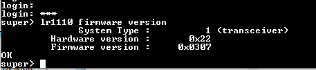</p>

- Update the LR1110 FW in bridge mode. With the command:

  `lr11xx firmware update bridge <serial interface> <speed>`

> the MCU will push the LR1110 transceiver binary file to LR1110 and
> then reboot the chip. Parameters are:

- Serial interface:

    |   |                          |   |   |
    |---|--------------------------|---|---|
    |0  | LPUART (USB3 connector)  |   |   |
    |2  | LPUART (USB3 connector)  |   |   |
    |   |                          |   |   |


- Speed:

    |   |            | |   |               |
    |---|------------|-|---|---------------|
    |0  | 1200 bauds | |5  | 38400 bauds   |
    |1  | 2400 bauds | |6  | 57600 bauds   |
    |2  | 4800 bauds | |7  | 115200 bauds  |
    |3  | 9600 bauds | |8  | 230400 bauds  |
    |4  | 9200 bauds | |9  | 460800 bauds  |
    |   |            | |   |               |


> The steps to take are:

1. Enter command: `lr11xx firmware update bridge 2 8` (using the USB
    interface -- USB2)
2. change Tera Term (or your terminal application. Exp: minicom) speed
    to 230400 bauds 8N1
3. start [`lr1110_transceiver_0308.bin`](https://github.com/Abeeway/abeeway-geolocation-module/tree/master/firmware-binaries/lr11xx/lr1110_transceiver_0308/)
   (actual LR1110 version)
    transfer with XMODEM to transfer the firmware.
4. when done return the speed to 57600 bauds and you can check the FW
    version (see picture below)

<p align="center">
  
</p>
<p align="center">
  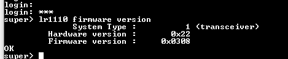
</p>

<p align="center"><i>Figure 8: Update LR1110 embedded firmware.</i></p>

### 3.3 LoRa provisioning

During production, the module is pre-provisioned with LoRa parameters
saved in the LR1110 chip. These parameters include DEVEUI, JOINEUI,
APPKEY, Region, and additional parameters related to the module PCB ID.
The current values of these parameters can be displayed using the
following commands:

```bash
provis system display
provis lora display
```

It is important to note that these parameters can also be modified using
the set command. However, altering these parameters may prevent the
module from successfully connecting to a LoRa network and the 2D code on
the module mapping the advised QR code of the lora alliance will get
obsolete. For provisioning the lora parameters see the manufacturing
application documentation

### 3.4 FW update of the MT3333 chipset

The GNSS chipset FW is also updated with a proprietary FW to support the
AGPS feature as well as the standard GNSS functions of the [MT3333](https://www.mediatek.com/products/location-intelligence/mt3333).

To flash the MT3333 with the
[MediaTek Flash Tool](https://github.com/Abeeway/abeeway-geolocation-module/blob/master/firmware-binaries/mt33xx/FlashTool_exe_v4.1.0.zip)
, the GNSS device must be enabled with the CLI command `gnss on` as shown in
*Figure 10* and supplied as shown in *Figure 1* (pin 30: VDD_GNSS and pin 32:
VDD_GNSS_BU set to 3.3V -- Jumpers 2,4,15). Flashing the MT3333 is then
possible via the GNSS UART interface accessible from USB1 connector via
the FTDI chip and selector J7.

The steps to download the MT33xx FW are

- Connect your computer to the USB1 port of the board
- Select the right baud rate (default: 115200)
- Click on the **Download Agent** button and select the [MTK_AllInOne_DA_MT3333_MP.BIN](https://github.com/Abeeway/abeeway-geolocation-module/tree/master/firmware-binaries/mt33xx) download agent (DA) program to receive the firmware and write it to the flash.
- Click on the **ROM** text in the 1st column of the table and select the
  [20190417_GENERAL_Module_AXN5.1.7_C33_SDK_11.bin](https://github.com/Abeeway/abeeway-geolocation-module/tree/master/firmware-binaries/mt33xx)
  firmware file to download in the ROM area.
- Click the **Download** button and **Go** to start downloading
- Download operations are shown with a red bar for the DA file and blue bar for the ROM file. A green circle is drawn when the process is completed.
- After the download has been completed, remove the USB cable from USB1 port and plug it into the USB2 port of the board.
- Connect to the CLI of the MFG Firmware and execute the `gnss mt3333 version` again to see if the firmware has been updated.

<p align="center">
  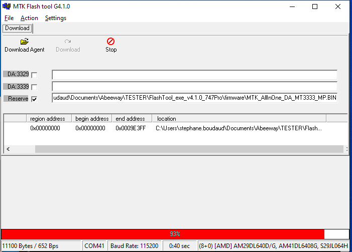
  &nbsp
  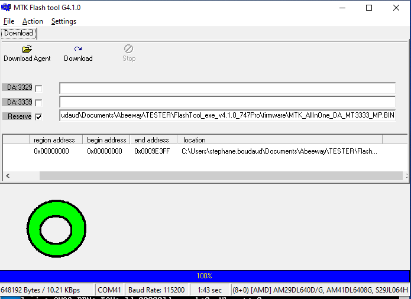
</p>

<p align="center"><i>Figure 9: Mediatek tool to flash the MT3333</i></p>

<p align="center">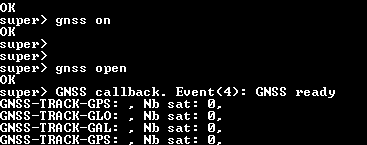</p>

<p align="center"><i>Figure 10: Command line to enable the GNSS and after programming, open
the UART link between STM32 and MT3333</i></p>
