# Table of Contents

[1 INTRODUCTION](#introduction)

[1.1 Purpose](#purpose)

[1.2 Intended Audience](#intended-audience)

[1.3 Minimum requirements](#minimum-requirements)

[2 PREPARING THE EVB BOARD AND FLASHING STM32WB](#preparing-the-evb-board-and-flashing-stm32wb)

[2.1 First flashing operation of the STM32WB](#first-flashing-operation-of-the-stm32wb)

[2.2 STM32CubeProgrammer with ST-Link](#stm32cubeprogrammer-with-st-link)

[2.3 Flash FUS and BLE stack Firmware upgrade](#flash-fus-and-ble-stack-firmware-upgrade)

[2.4 Flashing the Bootloader](#flashing-the-bootloader)

[2.5 Flashing an application firmware](#flashing-an-application-firmware)

[2.5.1 Flashing with the bootloader](#flashing-with-the-bootloader)

[2.5.2 Flashing with STM32Programmer or STM32CubeIDE](#flashing-with-stm32programmer-or-stm32cubeide)

[3 GEOLOC MODULE CONFIGURATION AND MIDDLEWARE UPDATE](#geoloc-module-configuration-and-middleware-update)

[3.1 Manufacturing firmware application (MFG)](#manufacturing-firmware-application-mfg)

[3.2 Update of the LR1110](#update-of-the-lr1110)

[3.3 LoRa provisioning](#lora-provisioning)

[3.4 FW update of the MT3333 chipset](#fw-update-of-the-mt3333-chipset)

# INTRODUCTION

## Purpose

The goal of this document is to provide a simple guide on how to flash
and test the functionality of the Geolocation Module LBEU5ZZ1WL-633 or
LBEU5ZZ1WL-857 using the EVK. The module with the latter part number
LBEU5ZZ1WL-857 does not include the MediaTek MT3333 GNSS chipset

This includes the software components running on STM32WB MCUs such as
the firmware Upgrade Service (FUS) and the Bluetooth LE stack for the
Cortex M0 and the application firmware for cortex M4 MCU. The document
also describes the FW update operations for the LR1110 and MT3333
chipsets.

## Intended Audience

The intended audience for this document is for the hardware, test, and
production teams.

## Minimum requirements

To follow this tutorial, you should have:

-   A EVK board of the Geoloc Module i.e EVK v2.3 or v2.4, P/N:
    LBEU5ZZ1WL-633EVB

-   A computer with the following software installed:

    -   [STM32CubeProgrammer](https://www.st.com/en/development-tools/stm32cubeprog.html)

    -   Tera Term (<https://ttssh2.osdn.jp/index.html.en>) or minicom
        under linux

# PREPARING THE EVB BOARD AND FLASHING STM32WB

## First flashing operation of the STM32WB

To flash custom firmware, we first need to flash STMicroelectronic's
firmware. It consists of two parts:

-   Firmware Upgrade Service ("FUS")

-   BLE Stack firmware

## STM32CubeProgrammer with ST-Link

If you have not yet installed the software, you can get it (for free)
here: <https://www.st.com/en/development-tools/stm32cubeprog.html>.

Once installed, connect the EVK on the ST-link USB3 interface and open
STM32CubeProgrammer. The figure below shows the minimum configuration to
program the geoloc module with USB cable connected to USB3. See the User
Manual of the [EVK
board](https://actilitysa.sharepoint.com/:f:/t/aby/EiX2Y8y8xhFCnn4DE78bWtkBpk2KVE9mOXlT7qOH0DFyyA?e=YS9t6h)
for further details of the board set-up

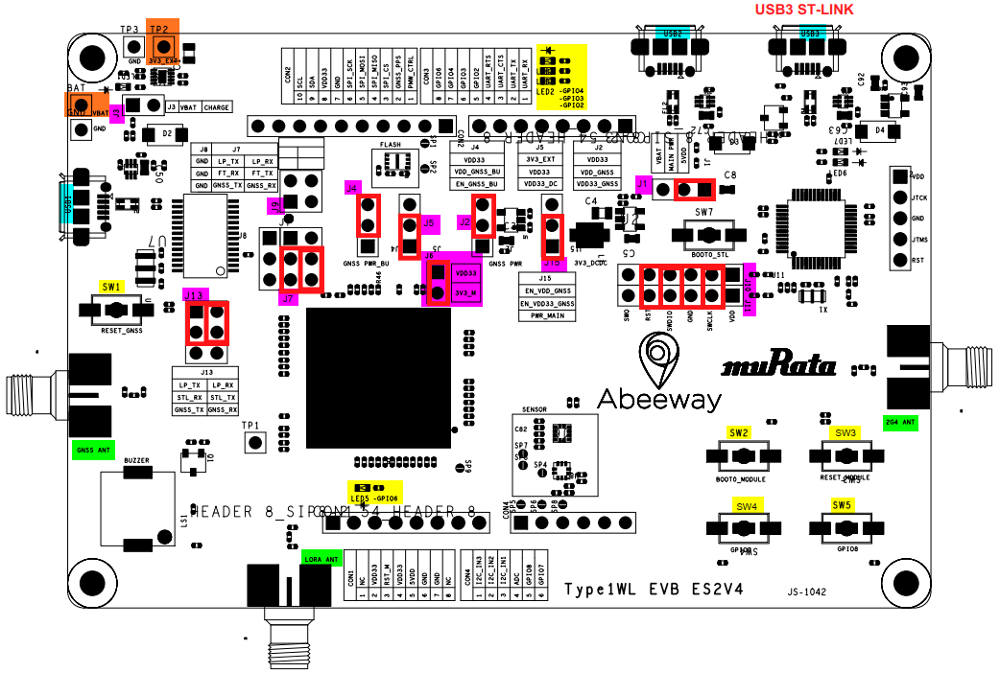

Figure 1: Default EVB setting in red. Module supplied with 5V USB
(J1,J5) and GNSS power up (J4, J15, J2)

To interface with the module for debugging and programming, select
ST-LINK protocol and click on the "Connect" button on the right-hand
side, as shown below:

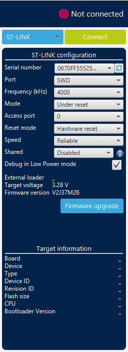
=>
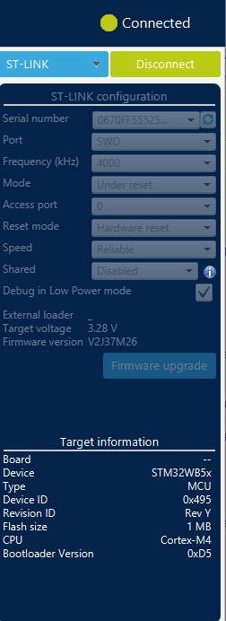

Figure 2: Connect the EVB via the ST-Link

If the software asks for upgrading the firmware of the ST-LINK, accept
and upgrade the firmware, then click on the Firmware Upgrade Service
icon, version used is shown below:

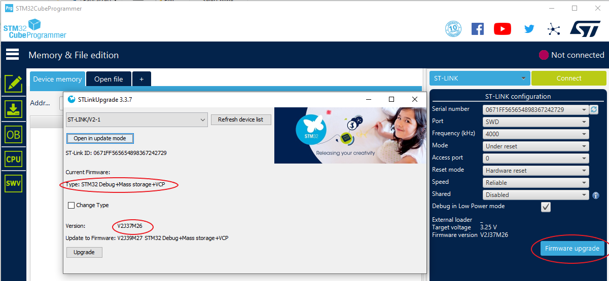

Figure 3: ST-Link update if needed

## Flash FUS and BLE stack Firmware upgrade

When ST-Link connected, go to the firmware upgrade services (FUS)
interface by clicking on the "radio type button" and initialize the FUS
by clicking on Start FUS. See log at the bottom of the windows

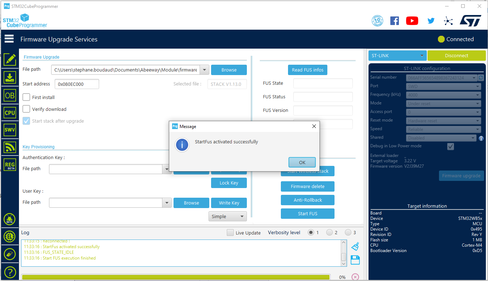

Figure 4: Start the FUS

Read the FUS version by clicking on Read FUS info. The initial version
is V1.0.2.0 and the FUS can be updated to version 1.2.0

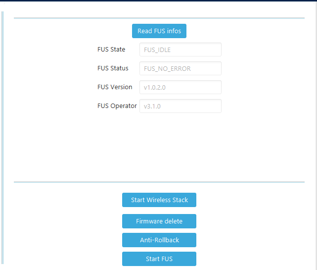

The FUS can be updated to version 1.2.0.0, by completing the file path
with the correct file: stm32wb5x_FUS_fw.bin and set the start address to
**0x080EC000** and click on Firmware upgrade.

You can check again the FUS version with Read FUS info.

Figure 5: Update FUS to version 1.2.0.0

The Bluetooth® LE Stack can be updated in the same way as the FUS.
Complete the path with the file: **stm32wb5x_BLE_Stack_full_fw.bin**,
set the start address to **0x080CE000** and click on "First install"
checkbox if this is the first time you are installing the stack. Then
press Firmware upgrade button.

Note: FUS needs to be activated to flash BLE firmware.

See section 4 REFERENCES, to see the latest version of the firmware.

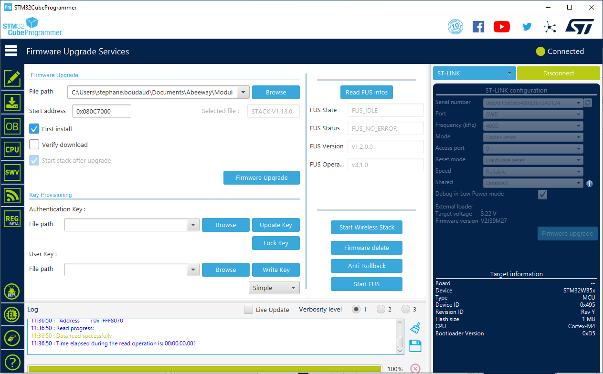

Figure 6: Update the BLE Stack V1.13.0

## Flashing the Bootloader

The next step is to flash the Bootloader firmware. This is a small piece
of code starting at address ***0x08000000** (beginning of the user flash
space)*.

The purpose of the bootloader is to check whether it should wait for an
application binary download via USB2 port or jump to the loaded
application firmware.

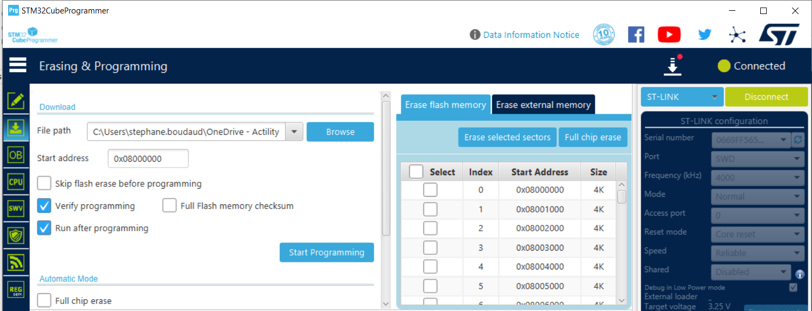

Figure 7: Flashing Bootloader

Note: It is possible to do a full chip erase prior to flash the
bootloader to erase any old application firmware (Item 0), BLE stack and
FUS will not get removed.

## Flashing an application firmware

### Flashing with the bootloader

At power up when no application software is installed, the bootloader is
directly accessible via the STM32 USB port (USB2 connector on EVK board)
using a terminal emulator (minicom or Teraterm) set to 57600 baud --
8N1. With an application, a CLI command allows to switch the MCU to
bootloader mode.

Note that the bootloader have a 60sec time out to switch back to the
application program.

Bootloader commands are:

> *ABWu: xModem transfer*
>
> *ABWe: erase user config*
>
> *v: version*
>
> *r: reset*
>
> *?: help*

Steps are:

1.  Enter command: ABWe (if flashing a new application FW in order to
    remove the user configuration parameters)

2.  Enter command: *ABWu*

3.  Load the .bin file to transfer with XMODEM

    a.  Minicom: CTRL A +S -\> Xmodem -\> Select .bin file

    b.  Teraterm : Menu -\> Transfer -\> Xmodem -\> Send + select .bin
        file

4.  Enter command: *r* to reset the device.

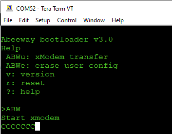

### Flashing with STM32Programmer or STM32CubeIDE

For experienced users, the application firmware can be uploaded via
STM32 software, and the user must ensure that the binary is correctly
uploaded at address: ***0x08006000.***

Warning: When an application is loaded directly to the flash, the user
must ensure that the user configuration parameter page is correctly set.
Running an application with corrupted parameters may prevent the program
to work properly.

# GEOLOC MODULE CONFIGURATION AND MIDDLEWARE UPDATE

## Manufacturing firmware application (MFG)

The MFG application firmware enables various features of the geoloc
module, configures the LoRaWAN credentials, updates 3^rd^ party
middleware for the MT3333 and LR11xx and enables some radio features for
testing and certification. This tool requires a terminal emulator such
as Teraterm for WS or Minicom for Linux (port must set to 57600 bauds, 8
data bits, no parity, one stop bit (8N1) to access the CLI interface via
USB and to enable various feature sets.

The MFG firmware is tailored to specific boards and can be uploaded with
the bootloader as described in section 2.5.

For the EVK board, 2 versions of the MFG firmware are available:

-   mfg-usb-evk-debug.bin (default version) : CLI using the STM32 USB
    interface (USB2 connector).

-   mfg-serial-evk-debug.bin: CLI using the LPUART and data is available
    from USB3. This version is useful to measure the low quiescent
    current since the USB function is disabled.

At power-up a prompt requests for a password. Log in with the pin code
\'123\' or \'456\'. The former provides normal user access, the latter
provides super-user access, making different sets of CLI commands
available. The \'help\' command is available throughout but typing any
invalid command or omitting a command option will usually show the
available commands or options. Commands can be abbreviated as long as
they remain unambiguous.

-   FW version is available with command: sys version \<RET\>

-   BLE and FUS version is available with command: ble version \<RET\>

-   LR11xx version is available with command: lr11 firm version \<RET\>

-   LoRa info (Mac, Region, DEVEUI...) is available with command: : lora
    information \<RET\>

## Update of the LR1110

To change the LR1110 FW version you need to login as a super user with
password 456.

Under lr1110 menu you can:

-   Check the LR1110 version with this command: *lr11xx firmware
    version*

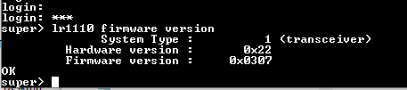

-   Update the LR1110 FW in bridge mode. With the command: *lr11xx
    firmware update bridge \<serial interface\> \<speed\>*

> the MCU will push the LR1110 transceiver binary file to LR1110 and
> then reboot the chip. Parameters are:

-   Serial interface:

  -----------------------------------------------------------------------
  0             LPUART (USB3 connector)
  ------------- ---------------------------------------------------------
  2             USB (USB2 connector)

  -----------------------------------------------------------------------

-   Speed:

+-----------------------------------+-----------------------------------+
|   ------------------------------  |   ------------------------------  |
|   0     1200 bauds                |   5     38400 bauds               |
|   ----- ------------------------  |   ----- ------------------------  |
|   1     2400 bauds                |   6     57600 bauds               |
|                                   |                                   |
|   2     4800 bauds                |   7     115200 bauds              |
|                                   |                                   |
|   3     9600 bauds                |   8     230400 bauds              |
|                                   |                                   |
|   4     19200 bauds               |   9     460800 bauds              |
|   ------------------------------  |   ------------------------------  |
+===================================+===================================+
+-----------------------------------+-----------------------------------+

> The steps to take are:

1.  Enter command: *lr11xx firmware update bridge 2 8* (using the USB
    interface -- USB2)

2.  change Tera Term (or your terminal application. Exp: minicom) speed
    to 230400 bauds 8N1

3.  start ***lr1110_transceiver_0308.bin*** (actual LR1110 version)
    transfer with XMODEM to transfer the firmware.

4.  when done return the speed to 57600 bauds and you can check the FW
    version (see picture below)

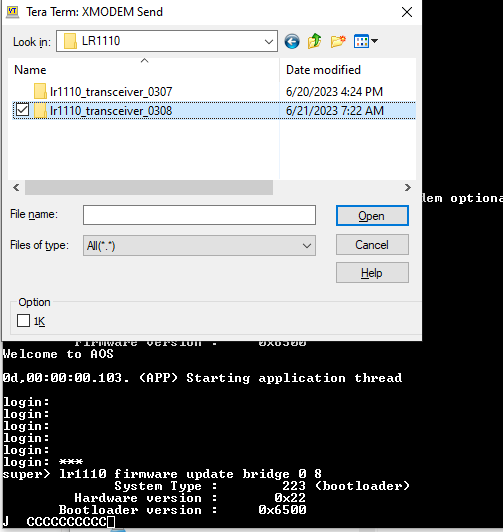

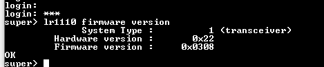

Figure 7: Update LR1110 embedded firmware.

## LoRa provisioning

During production, the module is pre-provisioned with LoRa parameters
saved in the LR1110 chip. These parameters include DEVEUI, JOINEUI,
APPKEY, Region, and additional parameters related to the module PCB ID.
The current values of these parameters can be displayed using the
following commands:

-   prov system display

-   prov lora display

It is important to note that these parameters can also be modified using
the set command. However, altering these parameters may prevent the
module from successfully connecting to a LoRa network and the 2D code on
the module mapping the advised QR code of the lora alliance will get
obsolete. For provisioning the lora parameters see the manufacturing
application documentation

## FW update of the MT3333 chipset

The GNSS chipset FW is also updated with a proprietary FW to support the
AGPS feature as well as the standard GNSS functions of the MT3333.

To flash the MT3333 with the MediaTek tool MTK Flash Tool, the GNSS
device must be enabled with the CLI command "gnss on" as shown in figure
10 and supplied as shown in figure 1 (pin 30: VDD_GNSS and pin 32:
VDD_GNSS_BU set to 3.3V -- Jumpers 2,4,15). Flashing the MT3333 is then
possible via the GNSS UART interface accessible from USB1 connector via
the FTDI chip and selector J7

The steps to download the MT33xx FW are

-   Select the COM port connected to the USB1

-   Select the right baud rate (default: 115200)

-   Select the download agent (DA) file. Program to receive the firmware
    and write it to the flash

-   Select the firmware to download in the ROM area

-   Click download and Go to start downloading

-   Download operations are shown with a red bar for DA file and blue
    bar for ROM file. A green circle is drawn when complete.

-   When complete, after a reset (module or MT3333), enable the GNSS
    chipset with the STM32 via the cli command "gnss open"

-   Command "gnss version" can be used to display the ROM FW version

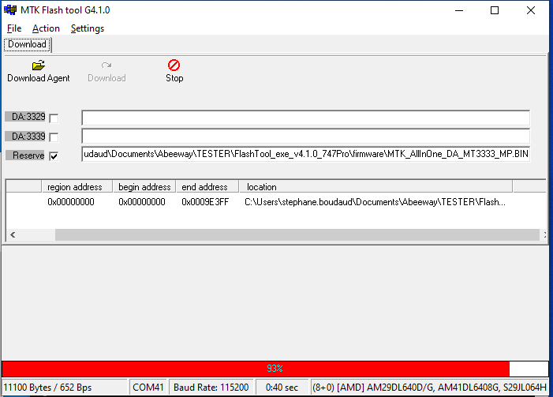
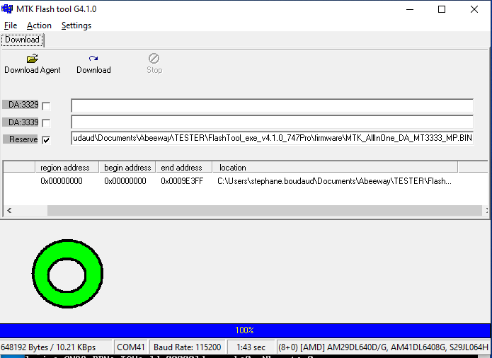

Figure 8: Mediatek tool to flash the MT3333

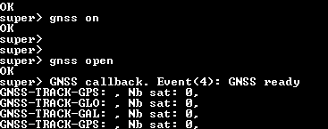

Figure 9: Command line to enable the GNSS and after programming, open
the UART link between STM32 and MT3333
